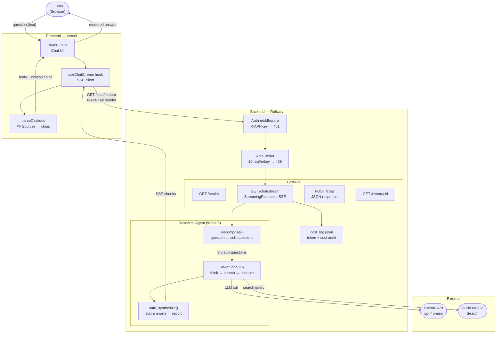

# Architecture

## Request lifecycle

1. User types a question → `useChatStream` opens a `fetch` SSE connection to `GET /chat/stream`
2. Auth middleware checks `X-API-Key` header → 401 if missing/invalid
3. Rate limiter checks sliding window per key → 429 if exceeded
4. `agent_runner.stream_agent` starts yielding SSE events:
   - `status` events for each pipeline stage (shown as status line in UI)
   - `chunk` events for each word group of the final answer (streamed token-by-token)
   - `done` event with `session_id` + `usage` when complete
5. On `done`, `parseCitations` splits `## Sources` into clickable chips
6. Cost is appended to `cost_log.jsonl`
